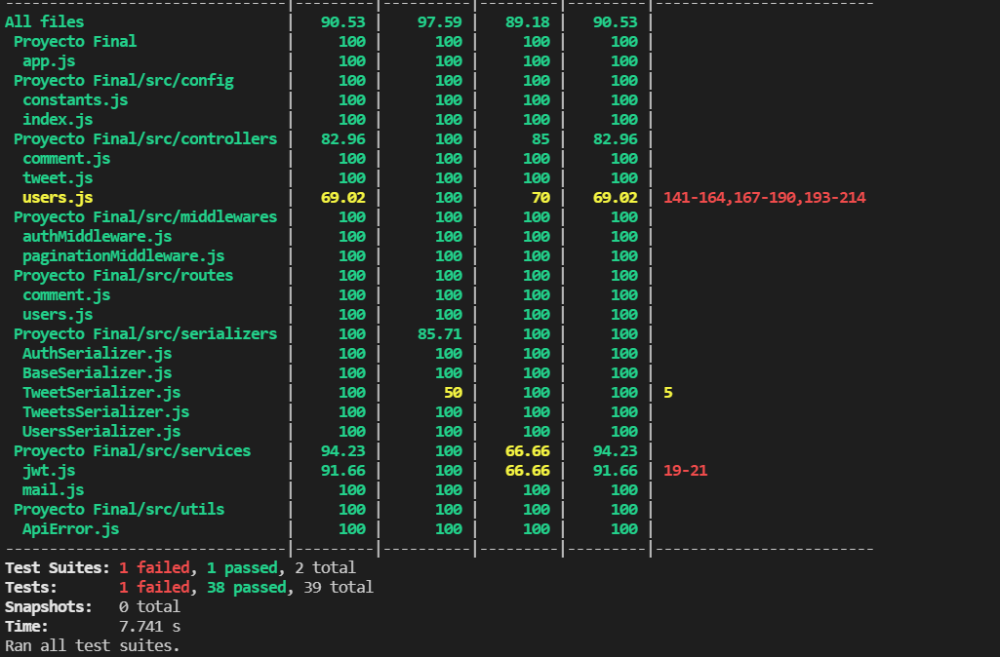
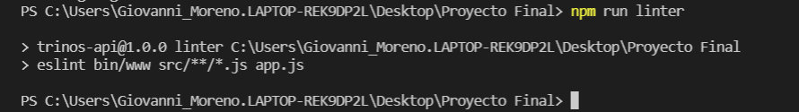

# Trinos API

## Setup
```
npm install
```

## Run tests
```bash
npm run test
```

## Run linter
```bash
npm run linter
```

## Students
```bash
Alejandro Manotas - 200108289
Cristian Porto - 200110620
Giovanni Moreno - 200109748
```

## Screenshot Test


## Screenshot Linter
